# Comparación y Evaluación de cinco Frameworks Web de Backend

## Descripción Aplicación
Aplicación que permite a los usuarios registrarse, iniciar sesión, publicar contenido y comentarlo. También permite a los administradores gestionar estadísticas, modificar información, censurar información no permitida y bloquear usuarios.

## Implementación
Aplicación web del tipo MPA implementada en 5 framework de backend distintos:
- Django: https://github.com/danielviei/tesis-django-app
- ASP .NET CORE: https://github.com/danielviei/NetCoreApp
- Laravel: https://github.com/Eduhuu/laravel-app
- Express JS: https://github.com/Eduhuu/express-pug-app
- Ruby on Rails: https://github.com/Eduhuu/ruby-on-rail-app

## Motivación
Esta aplicación permitirá evaluar las capacidades de los frameworks seleccionados en cuanto a la presentación de datos, paginación, operaciones CRUD (Crear, Leer, Actualizar, Eliminar), y manejo de relaciones entre modelos.

- Las publicaciones con comentarios permitirán evaluar las operaciones CRUD, paginación y las relaciones entre modelos.
- Las parte administrativa permitirá evaluar la gestión de estadísticas, modificación de información, bloqueo de usuarios, y las capacidades de autenticación y autorización.
- Las recuperación de contraseña permitirá evaluar la validación por correo electrónico y el proceso de restauración de contraseña.

## Metodología
La aplicación esta requisitada y diseñada usando la metodología UP. Al ser una metodología dirigida por casos de uso, se podrá realizar una traza desde los requisitos, hasta el código implementado en cada framework. Esta trazabiliad permite verificar la transformación de los requisitos en elementos de modelo sucesores, resultantes del análisis y diseño, implementación, pruebas y despliegue. De esta manera se podrá comparar cada framework y las aplicaciones resultantes de manera más efectiva.

| 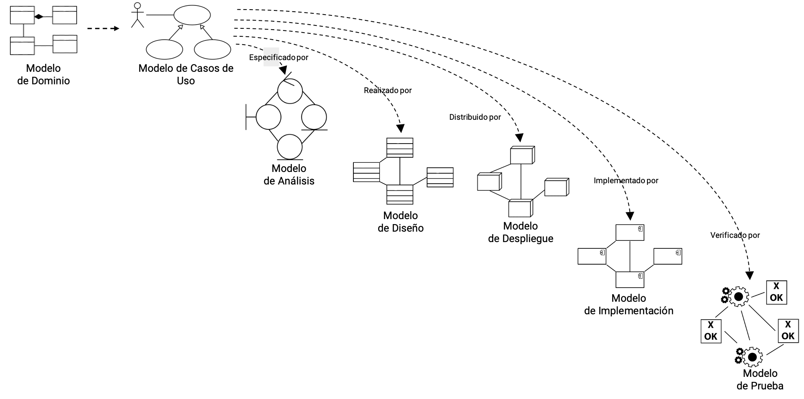 Trazabilidad de Requisitos por disciplinas |
| :---: |

## Modelo de Casos de uso

### Usuario no registrado
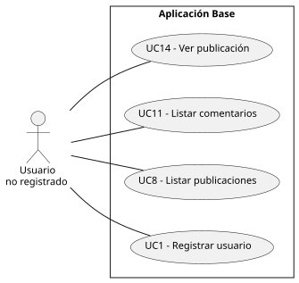

### Usuario registrado
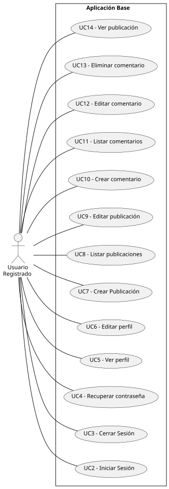

### Usuario administrador
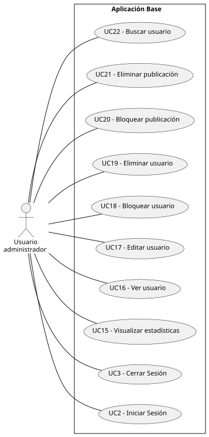

### Especificaciones de casos de uso
La descripción de cada caso de uso lo podrá ver en: [especificaciones de los casos de uso](scenariosView/useCaseModel/useCaseSpecifications.md)

### Prototipo de pantallas
Los prototipos de las pantallas las podrá ver en: [prototipo de pantallas](scenariosView/useCaseModel/prototype/prototype.md)

### Trazabilidad entre pantallas y casos de uso
| 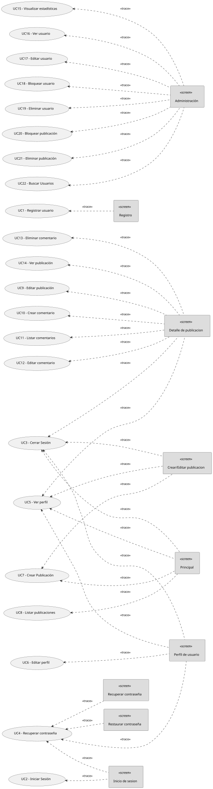 |
| :---: |

## Modelo de Análisis

### Diagrama de clases de análisis
#### Usuario no registrado
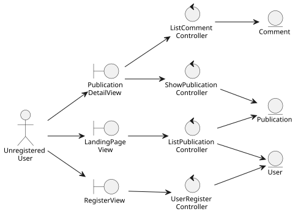

#### Usuario registrado
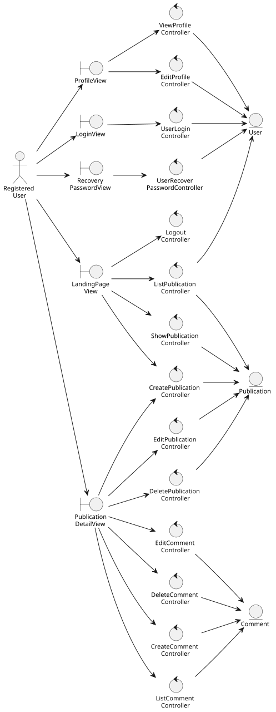

#### Usuario administrador
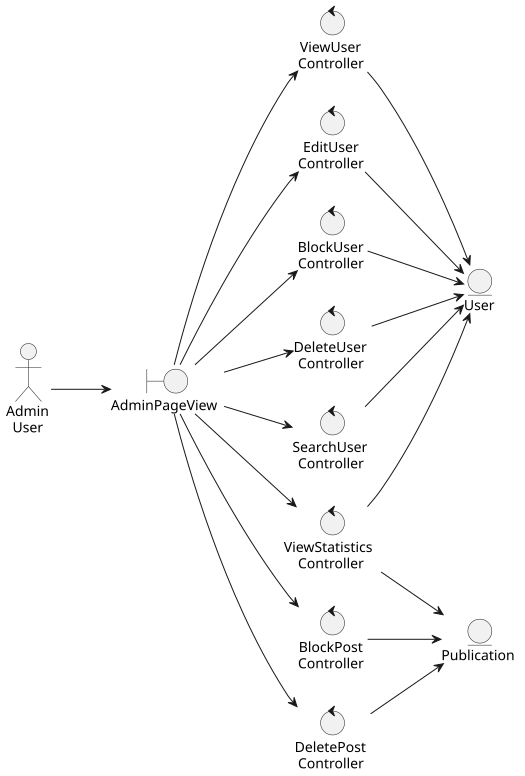

### Arquitectura de análisis
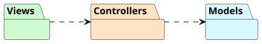

### Realización de análisis de casos de uso

#### Diagrama de clases de análisis de UC7 – Crear Publicación
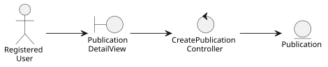

#### Diagrama de colaboración de análisis de UC7 – Crear Publicación
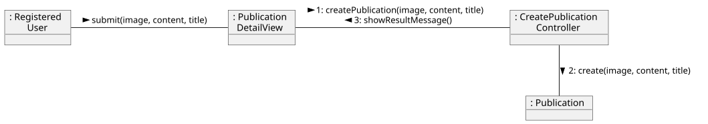

## Modelo de Diseño Framework Express

### Arquitectura de Sistema
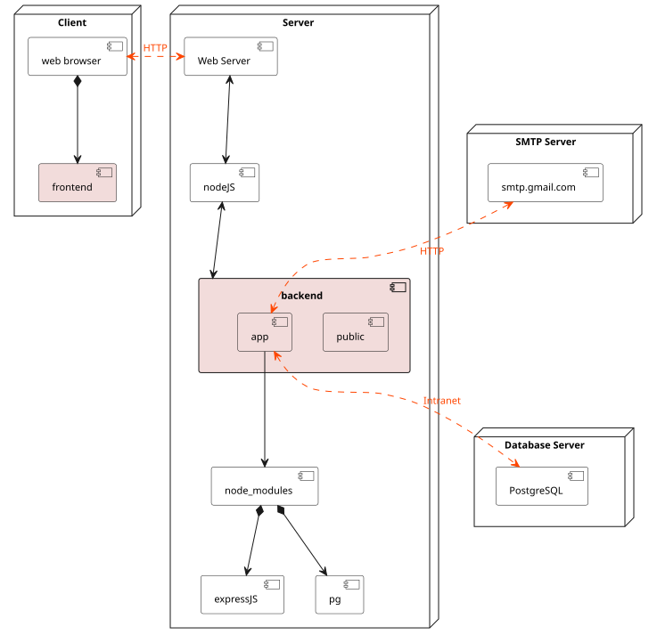

### Arquitectura de Software
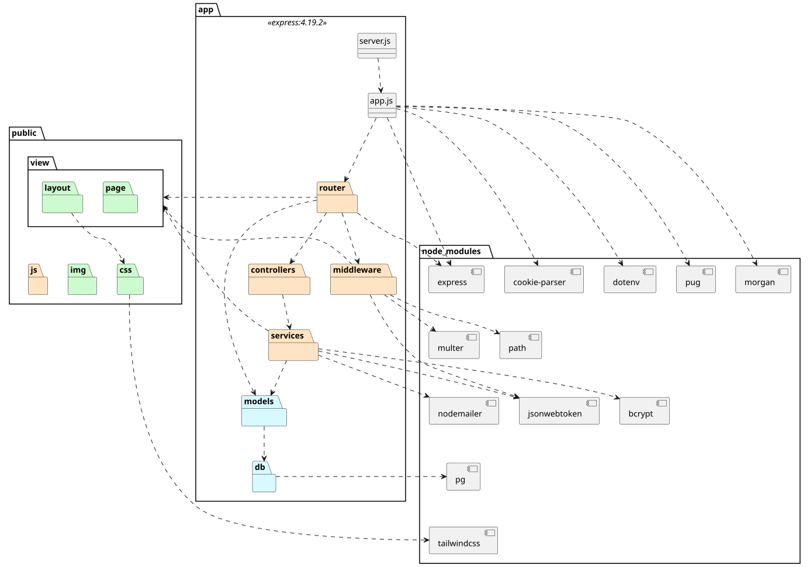

### Diagrama de clases de diseño UC7 – Crear Publicación
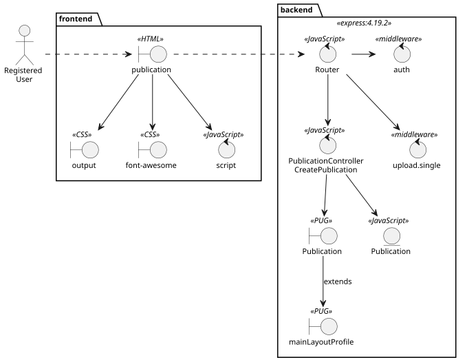

### Traza de Diagrama clases de análisis y diseño UC7 – Crear Publicación
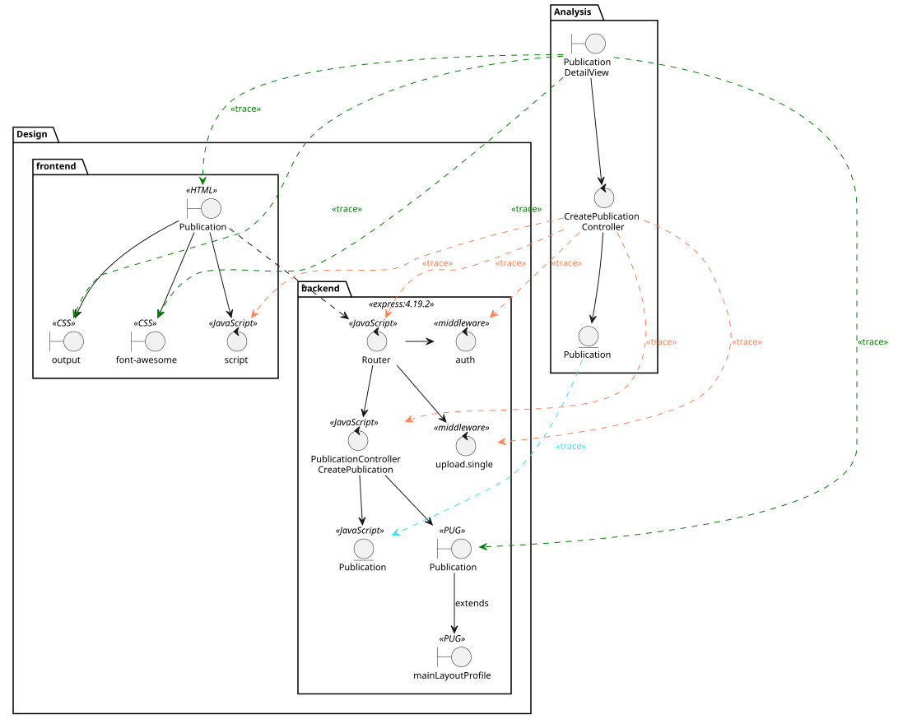

### Diagrama de secuencia UC7 – Crear Publicación
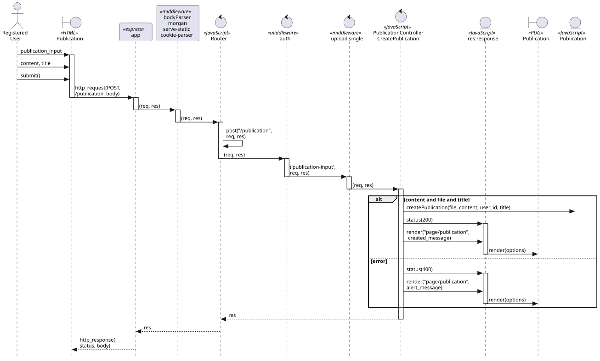

## Modelo de Diseño Framework Django

### Arquitectura de Sistema
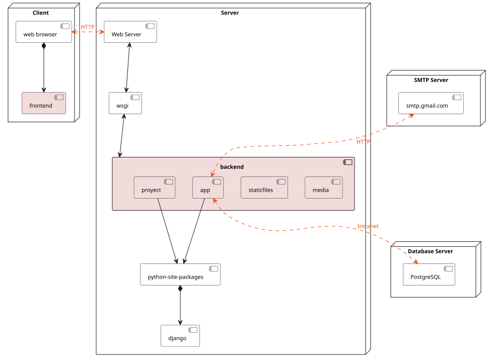

### Arquitectura de Software
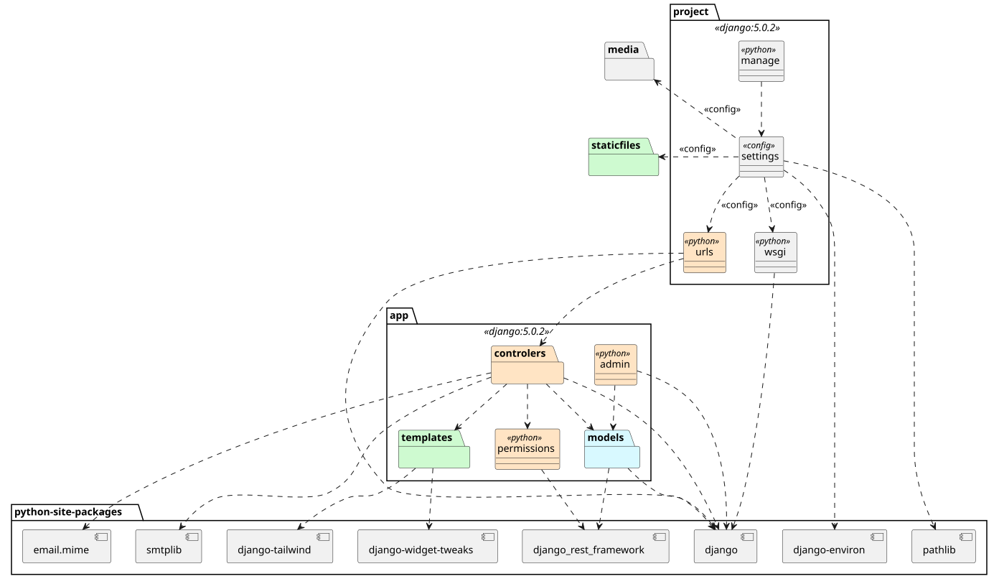

### Diagrama de clases de diseño UC7 – Crear Publicación
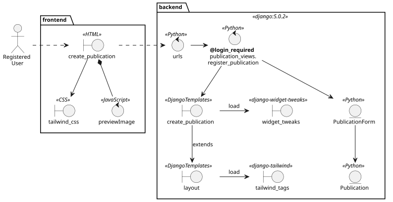

### Traza de Diagrama clases de análisis y diseño UC7 – Crear Publicación
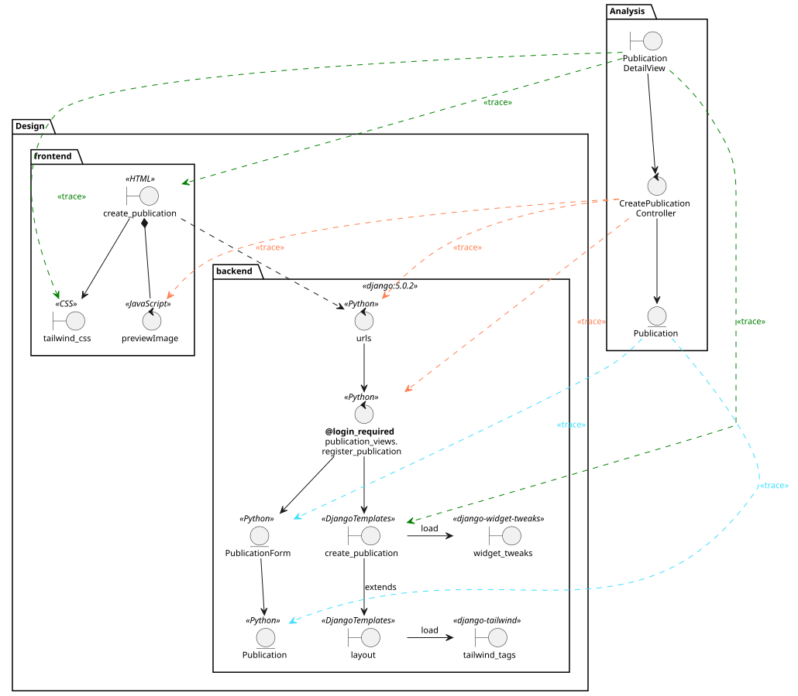

### Diagrama de secuencia UC7 – Crear Publicación
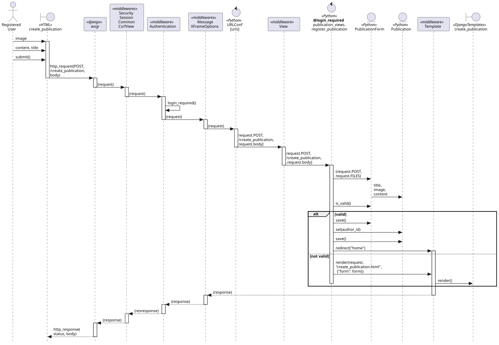
